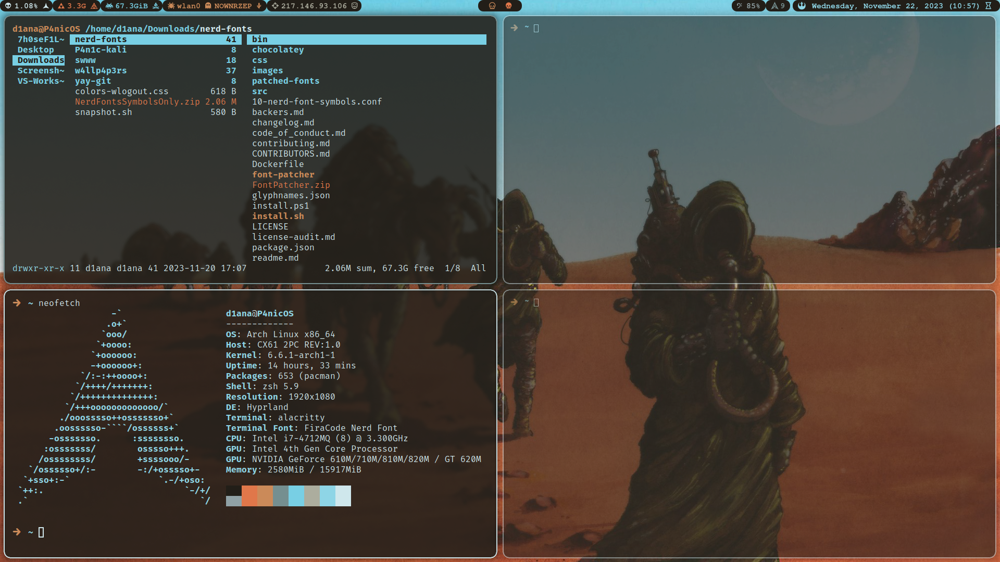
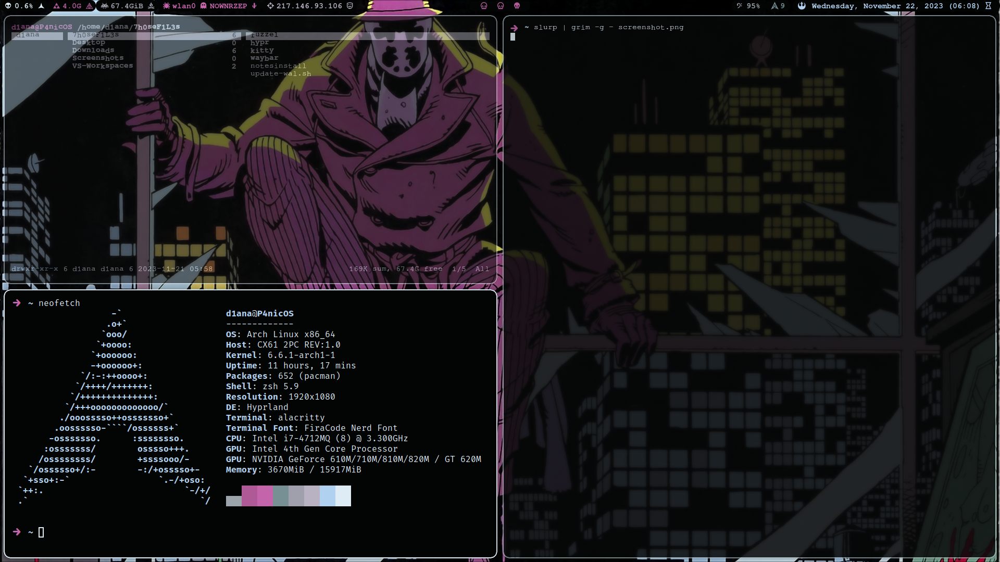

## Synopsis:

- Simple installation script for Arch Linux with `wayland`, `hyperland` and `waybar` riced with `py-wal`
- It also unlocks the `blackarch` library and downloads some basic security utils.
- This is a bare metal only setup.
- Uses dark theme.
  
### Futures features and fixes:

  - `Ranger` and `kitty` integration.
  - Virtualization. 
   


## Details:

| Category               | Software               
|------------------------|------------------------|
| Window Manager         | Hyprland               |
| Terminal Manager       | Alacritty, kitty       |
| File Manager           | Ranger, Nemo           |
| Status Bar             | Waybar                 |
| Launcher               | Rofi                   |
| Shell                  | Zsh                    |
| Browser                | Librewolf              |
| Text Editor            | neovim, Visual Code    |

### Waybar:

- Custom module to see how many updates are available.
- Custom module to check and show your public ip.
- Fully customized style with `pywal` integration and nerdfont icons.
- Network module opens the `Network.Manager GUI`.
  
### Additional Packages included:

`pacman-contrib`  `yay`  `exa`  `bat`  `ufw`  `wireshark`  `bleachbit`  `virtualbox`  `burp`  `obsidian`  `nordvpn`  `signal`  `btop`  `wget`  `curl`  `locate`  `qflipper`  `neofetch`  `python`  `rust`  `jre-openjdk`  `jdk-openjdk`  `go`  `pamixer`  `cmus`  `scrub` `pam_yubico` `pam-u2f` `burpsuite`

### Zsh Plugings, Aliases and Functions:

- `Ohmyzsh` and `pywal` integration.
- Some handy aliases to use `systemctl` and your system in general.
- `Git` pluging and most useful aliases.
- `Cheat.sh` implemented on a function to use as `cheat <argument>`
- Safe deletion of files using `scrup` and `schred` on a funtion to use as `rmk <argument>`
- Some `zsh` plugins.

### Custom Scripts:

- Waybar reset for troubleshooting.
- Theme Change.
- Screenshot and edition.

### Cybersecurity features:

- `yubikey` integration for passwordless `sudo`.
- `blackarch` library.
- `wireshark` profiles.
- Just use `signal`.

## Installation:

- Make you sure you have a `USB` ready to use with a verified Arch `ISO`
- You can use `rufus` or `dd` command in linux:
```bash
# Lookup for your USB drive
sudo fdisk -l
# Lookup for the path of your ISO file
realpath isofile
# Create the bootable USB
sudo dd bs=4M if=/home/shutter/Documents/ISOs/archlinux-2023.10.14-x86_64.iso of=/dev/sdb
```
- Once you booted the `USB` and accessed the Arch `ISO` you may need to connect to your `wifi`
```bash
# Start iwctl
iwctl
# list devices
device list
# Interface set to scan
station wlan0 scan
# Scan for networks
station wlan0 get-networks
# Connect to a network
station wlan0 connect networkname
```
- Just run the `archinstall` script. This are the only relevant steps that you need to follow for this build:
  - Use `ext4` file type for your system.
  - `Systemd-bootloader` can give you problems with encryptation, in that case just use `GRUB`
  - Choose `Hyperland` as profile.
  - Choose `NetworkManager`
  - Extra libraries for `32bit` support.
  - Once is done reboot your system.
  
- Edit `pacman.conf`
```bash
nano /etc/pacman.conf
# Uncoment Color
# Set ParallelDownloads = 5
# Add "ILoveCandy"
```
- Now you should need to connect to the internet, this time use `NetworkManager` from your system:
```bash
# Check if Networkmanager is running
sudo systemctl status NetworkManager.service
sudo systemctl start NetworkManager.service
# Connect to wifi
nmcli device wifi list
nmcli device wifi connect SSID_or_BSSID password password
# Different interface
nmcli device wifi connect SSID_or_BSSID password password ifname wlan1 profile_name
# Hidden network
nmcli device wifi connect SSID_or_BSSID password password hidden yes
```
- And download this repository:
```bash
https://github.com/b0llull0s/P4n1c-Arch.git
cd ~/P4nic-Arch
chmod +x *.sh
```
- You may also want to create a new directory with your desired profile name on `Wireshark/profile` and move the files inside.
- You may want to add your wallpapers to the `w4llp4p3rs` folder or just change the name and path on the script as you want.
- If you experience problems with `py-wal`, make sure that all the paths inside the config files match with your system files.

### NordVPN:

- You need to do it manually in `Arch`
```bash
# Login first
nordvpn login
# Copy the link
nordvpn login --callback "nordvpnlink"
# Or use a generated token
nordvpn login --token "tokencode"
```

### Yubikey:

- To intagrate your `yubikey` for passwordless sudo:
```bash
# Introduce this command, if it generates a hash is all good
pamu2fcfg
# Create the directory for the config files
mkdir -p ~/.config/Yubico
# Now register the hash in the config file
pamu2fcfg -o pam://me -i pam://me > ~/.config/Yubico/u2f_keys
```
- Now configure `PAM`. **Don't close the `PAM` file until you make it work if you want to avoid pain!!!**
```bash
sudo nano /etc/pam.d/sudo
```
- Make sure the file looks like this:
```bash
#%PAM-1.0
account         include         system-auth
session         include         system-auth
auth            sufficient      pam_u2f.so cue origin=pam://me appid=pam://me
```
- Without closing the `PAM` file test to see if it works:
```bash
sudo echo "SUCCESS"
```



## Tips:

- In case you need to generate a new `py-wal` template just run:
```bash
wal -i ~/Downloads/w4llp4p3rs/1.jpg
```
- In case you need to make zsh your default shell:
```bash
usermod --shell /usr/bin/zsh username
```
- Refresh your system data base:
```bash
sudo updatedb
``` 
- To implement plugings use locate to find the path of the plugin file and add it to your source file:
```bash
# use this command:
locate zsh-autosuggestions
# Copy the .zsh entry and add it as source in the config file:
source /usr/share/zsh/plugins/zsh-autosuggestions/zsh-autosuggestions.zsh
```
- Nowdays with `Steam` using `proton` you dont need to install the `graphical drivers` yourself, the correct drivers for your system will be install when installing `proton` from `Steam`

## Keybindings:

| Key Combination                      | Action                  |
|--------------------------------------|-------------------------|
| `Super + Enter`                      | Alacritty               |
| `Super + F`                          | Librewolf               |
| `Super + K`                          | Kill Window             |
| `Super + D`                          | Rofi                    |
| `Super + E`                          | Nemo                    |
| `Super + [1-9]`                      | Switch Workspace        |
| `Super + [SHIFT] + [1-9]`            | Move Window to Workspace|
| `Super + [SHIFT] + [ARROW]`          | Resize Window           |
| `Super + [ARROW]`                    | Move within Windows     |
| `Super + P`                          | Toggle Split            |
| `Super + O`                          | Toggle Float            |
| `Super + I`                          | Swap Horizontal/Verical |
| `Super + U`                          | Full screen             |
| `Super + [PRINTSCRN]`                | Screenshot              |
| `Super + C`                          | VSCode                  |
| `Super + T`                          | Obsidian                |
| `Super + X`                          | code .config            |
| `Super + Z`                          | code .zshsrc            |
| `Super + S`                          | Signal                  |
| `Super + W`                          | Wireshark               |
| `Super + B`                          | Reset waybar            |
| `Super + N`                          | Changes theme           |
| `Super + Q`                          | Volume Up               |
| `Super + A`                          | Volume Down             |

## Credits and appreciations 

- Credit to **_Stephan Raabe_** for the base idea behind the custom scripts and all the `pywal` integration without his youtube channel would have been way harder.
- Credit to **_s4vitar_** for the `rmk` function.
- Credit to the **_annonymous_** user who posted the `waybar` custom module to see your public ip.
- Credit to **_@PenAce_** for the `wireshark` profiles taken from his awesome video.
- Credit to **_Alan Moore_** and **_Dave Gibbons_** for `image1` and The band **_Sleep_** for `image2`
- Wallpaper by **_Wenqing Yan_**. ;) 


